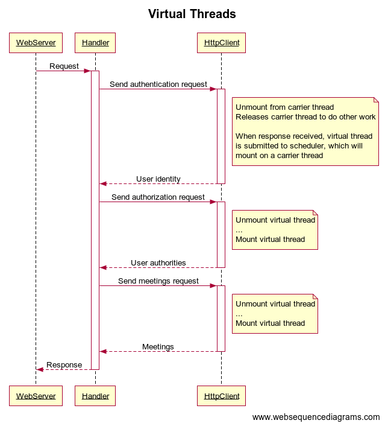
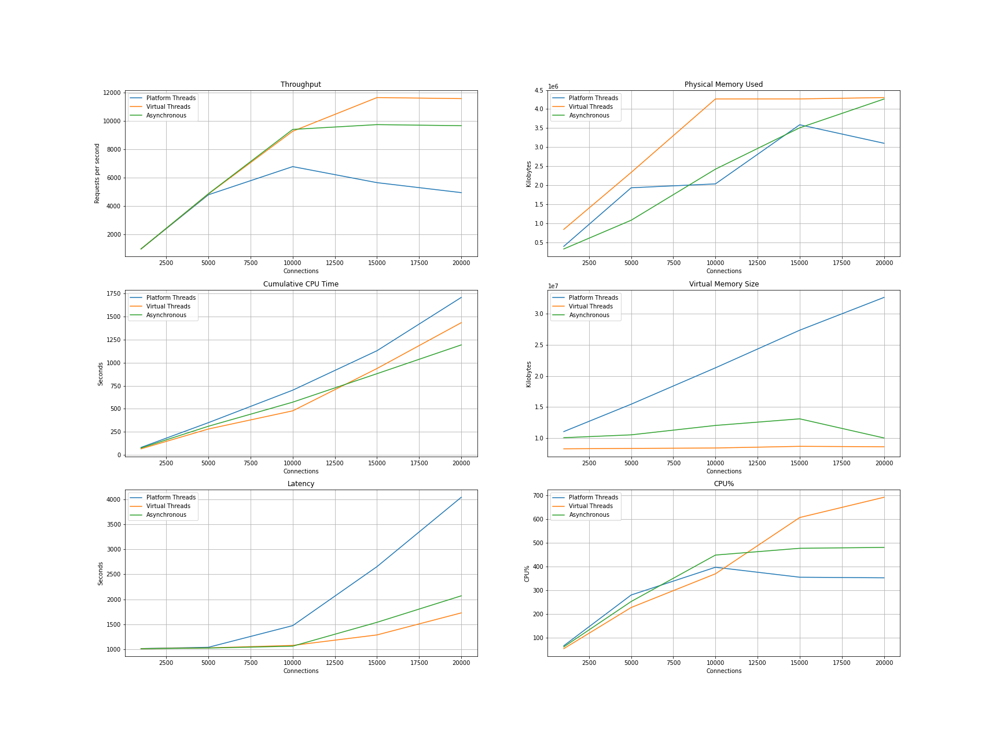

# Project Loom Comparison

This project compares different methods for achieving scalable concurrency in Java
in the context of a representative web service architecture.

* Platform OS threads
* Virtual threads
* Asynchronous programming

The following model is used. A browser talks to a frontend web service, 
which talks to three separate backend web services for authentication, 
authorization, and database access.

The frontend service simply calls each backend service in succession.
Each backend call requires context from the prior calls, as show in the
dependency diagram.

Each backend call introduces 1/3 second of latency. The target latency
from browser to frontend web service is therefore 1 second. This arrangement
is ideal for experimenting with concurrency. The server latency is overwhelmingly
due to wait time.


# Components

In the following experiments, we'll see how throughput and latency respond
to increase in concurrency.

Three separate handler implementations in the frontend web service are compared:

* Platform OS threads
* Virtual threads
* Asynchronous programming

## Platform Threads

The following sequence diagram outlines to interaction between components
in the frontend web server with platform threads.


## Asynchronous Programming

The following sequence diagram outlines to interaction between components
in the frontend web server with asynchronous programming.


## Virtual Threads

The following sequence diagram outlines to interaction between components
in the frontend web server with asynchronous programming.



# Experiment

Experiments were conducted on EC2 instances:

* c5.2xlarge
* 16GB RAM
* 8 vCPU
* Amazon Linux 2 with Linux Kernel 5.10, AMI ami-00f7e5c52c0f43726
* Project Loom Early Access Build 19-loom+5-429 (2022/4/4) from https://jdk.java.net/loom/

Three EC2 instances were used as follows:

* EC2[1] - ApacheBench HTTP benchmark acting as browser
* EC2[2] - Frontend server the makes 3 calls to backend in succession
* EC2[3] - Backend server that provides authentication, authorization, and database

## ApacheBench

ApacheBench is an HTTP benchmarking tool. It sends the indicated number of requests 
continuously using a specified number of persistent connections.

The following concurrency levels and workloads were tested:

* `-c 1000 -n 120000`
* `-c 5000 -n 600000`
* `-c 10000 -n 1200000`
* `-c 15000 -n 1800000`
* `-c 20000 -n 2400000`

```
$ ab -k -c 1000 -n 120000 -H "Authorization: token" http://10.39.197.143:9000/meetings
```

## Frontend

The frontend web server receives connections and requests from ApacheBench.
For each request received, it makes three calls in succession to the backend 
web server. Each backend call has a configured latency of 1/3 seconds, so the
target latency at the frontend web server is 1 second.

```
$ ./jdk-19/bin/java --enable-preview -cp project-loom-example-1.0.0-SNAPSHOT-jar-with-dependencies.jar loomtest.Frontend 0.0.0.0 9000 thread 1000 10.39.196.215:9000 8192 false
Args[host=0.0.0.0, port=9000, type=thread, threads=1000, backend=10.39.196.215:9000, acceptLength=8192, debug=false]
```

## Backend

The backend web server receives connections and requests from the frontend
web server. It responds to each request after a configured delay of 1/3 seconds.

```
./jdk-19/bin/java -cp project-loom-example-1.0.0-SNAPSHOT-jar-with-dependencies.jar loomtest.Backend 0.0.0.0 9000 333 8192 false
```

# Results

The handler using virtual threads outperforms the others.
It achieves lower latency and higher throughput while using less
overall CPU time for the same workload.

* All frontend configurations achieve the target latency up to concurrent of 5,000
* All frontend configurations are eventually CPU bound
* Beyond concurrency 5,000, platform threads degrade quickly
* Platform thread virtual memory increasing linearly with concurrency, due to stack memory
* Platform thread consistency spends more CPU for the same amount of work

Results were gathered from `ab` and `ps` output. The following `ps` command was
used to gather metrics on the frontend web server EC2 instance:

```
ps -C java -o args:100,pcpu,cputime,pid,pmem,rss,vsz
```



# Raw Data

The following Python snippets include the raw data and the matplot
lib code to generate plots.

```python
x = [1000, 5000, 10000, 15000, 20000]

type_thread = {
    'label': 'Platform Threads',
    'duration': [121.864, 125.004, 176.969, 318.481, 484.875],
    'latency': [1015.532, 1041.697, 1474.743, 2654.009, 4040.624],
    'throughput': [984.71, 4799.86, 6780.84, 5651.83, 4949.73],
    'cputime': ['00:01:21', '00:05:50', '00:11:42', '00:18:50', '00:28:28'],
    'rss': [397276, 1934504, 2036636, 3588076, 3102536],
    'vsz': [11062040, 15458340, 21293252, 27327492, 32585860]
}

type_virtual = {
    'label': 'Virtual Threads',
    'duration': [121.775, 123.578, 129.480, 154.657, 207.505],
    'latency': [1014.791, 1029.815, 1079.002, 1288.804, 1729.205],
    'throughput': [985.42, 4855.24, 9267.83, 11638.70, 11566.01],
    'cputime': ['00:01:06', '00:04:41', '00:07:58', '00:15:37', '00:23:54'],
    'rss': [842032, 2337268, 4265148, 4265612, 4301388],
    'vsz': [8300160, 8366728, 8433296, 8699568, 8633000]
}

type_async = {
    'label': 'Asynchronous',
    'duration': [121.651, 123.146, 127.690, 184.894, 248.448],
    'latency': [1013.756, 1026.217, 1064.080, 1540.781, 2070.396],    
    'throughput': [986.43, 4872.26, 9397.79, 9735.32, 9659.99],
    'cputime': ['00:01:15', '00:05:11', '00:09:32', '00:14:41', '00:19:53'],
    'rss': [328928, 1082940, 2423148, 3508304, 4263280],
    'vsz': [10085308, 10542920, 12049948, 13110868, 10042428]
}
```

```python
def to_seconds(txt):
    parts = txt.split(':')
    return int(parts[0]) * 60 * 60 + int(parts[1]) * 60 + int(parts[2])
```

```python
import matplotlib.pyplot as plt

fig, axes = plt.subplots(3, 2)

ax11, ax21, ax12, ax22, ax13, ax23 = axes.ravel()

for d in [type_thread, type_virtual, type_async]:
    ax11.plot(x, d['throughput'], label=d['label'])
ax11.set_xlabel('Connections')
ax11.set_ylabel('Requests per second')
ax11.set_title('Throughput')
ax11.grid()
ax11.legend()

for d in [type_thread, type_virtual, type_async]:
    ax12.plot(x, [to_seconds(c) for c in d['cputime']], label=d['label'])
ax12.set_xlabel('Connections')
ax12.set_ylabel('Seconds')
ax12.set_title('Cumulative CPU Time')
ax12.grid()  
ax12.legend()

for d in [type_thread, type_virtual, type_async]:
    ax21.plot(x, d['rss'], label=d['label'])
ax21.set_xlabel('Connections')
ax21.set_ylabel('Kilobytes')
ax21.set_title('Physical Memory Used')
ax21.grid()    
ax21.legend()

for d in [type_thread, type_virtual, type_async]:
    ax22.plot(x, d['vsz'], label=d['label'])
ax22.set_xlabel('Connections')
ax22.set_ylabel('Kilobytes')
ax22.set_title('Virtual Memory Size')
ax22.grid()    
ax22.legend()

for d in [type_thread, type_virtual, type_async]:
    ax13.plot(x, d['latency'], label=d['label'])
ax13.set_xlabel('Connections')
ax13.set_ylabel('Seconds')
ax13.set_title('Latency')
ax13.grid()    
ax13.legend()

for d in [type_thread, type_virtual, type_async]:
    cpufac = [(to_seconds(d['cputime'][n]) / d['duration'][n]) * 100 for n in range(len(d['cputime']))]
    ax23.plot(x, cpufac, label=d['label'])
ax23.set_xlabel('Connections')
ax23.set_ylabel('CPU%')
ax23.set_title('CPU%')
ax23.grid()    
ax23.legend()

fig.set_size_inches(24, 18)
plt.savefig('project-loom-comparison.png')
plt.show()
```